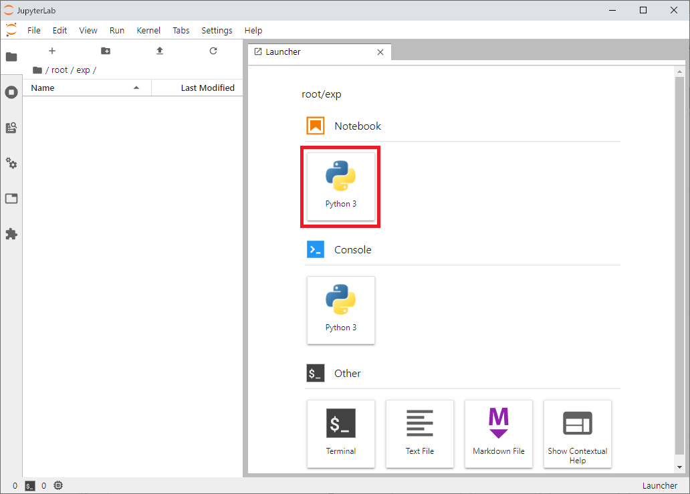
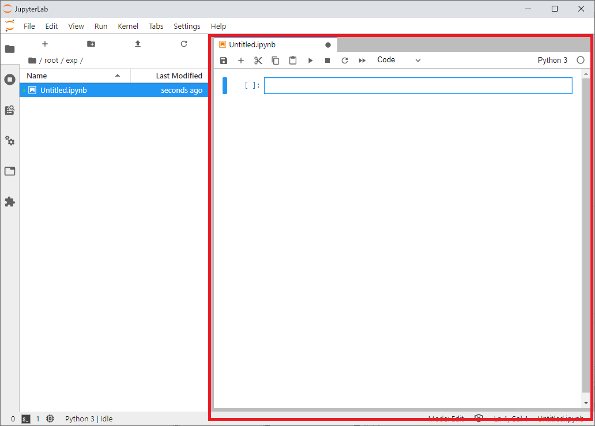

# Experiment

## Experiment ait what do something

You will examine what this AIT takes as input and what it evaluates and outputs through experiments.

* work dir

    ```
    {testbed_root}\ait_repository\ait\{Your AIT name}\exp
    ```

    * if you need data, into this directory.


* use jupyter lab and write experiment notebook

    * click `root` -> `exp`

        

    * click `Notebook Python3`

        

    * and write experiment notebook

        
