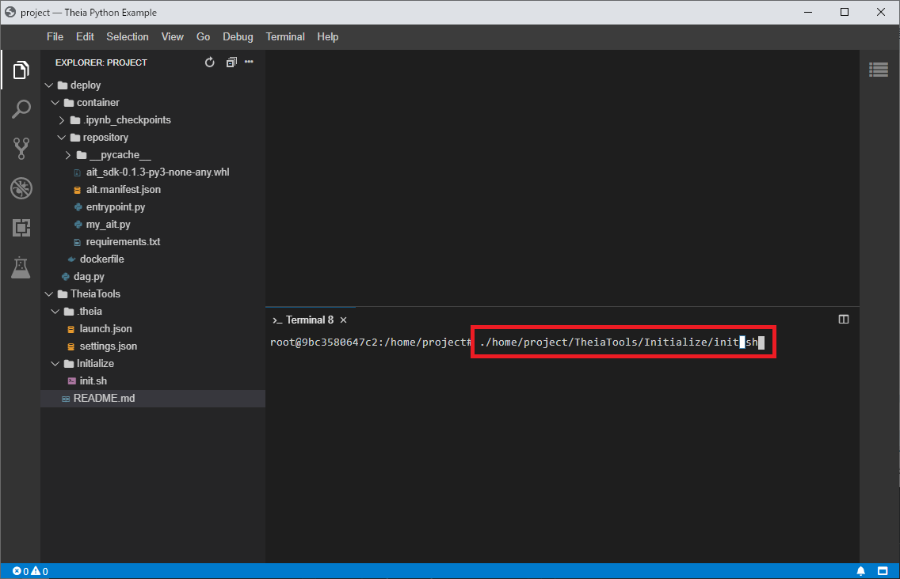
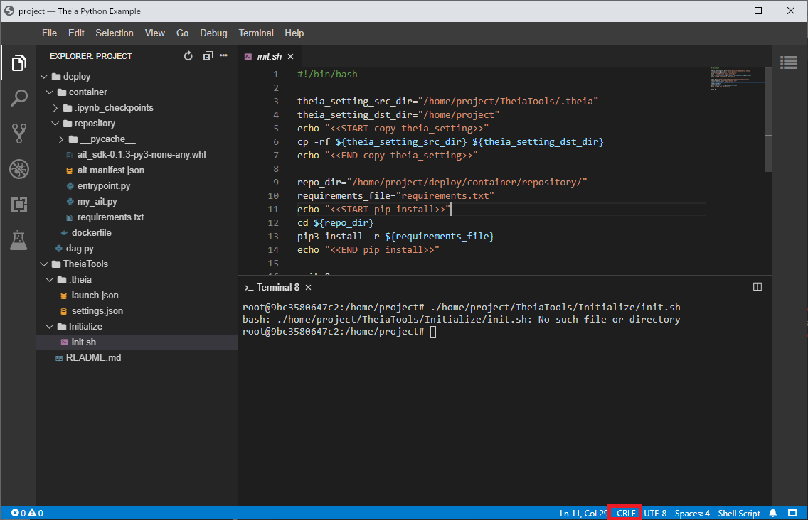
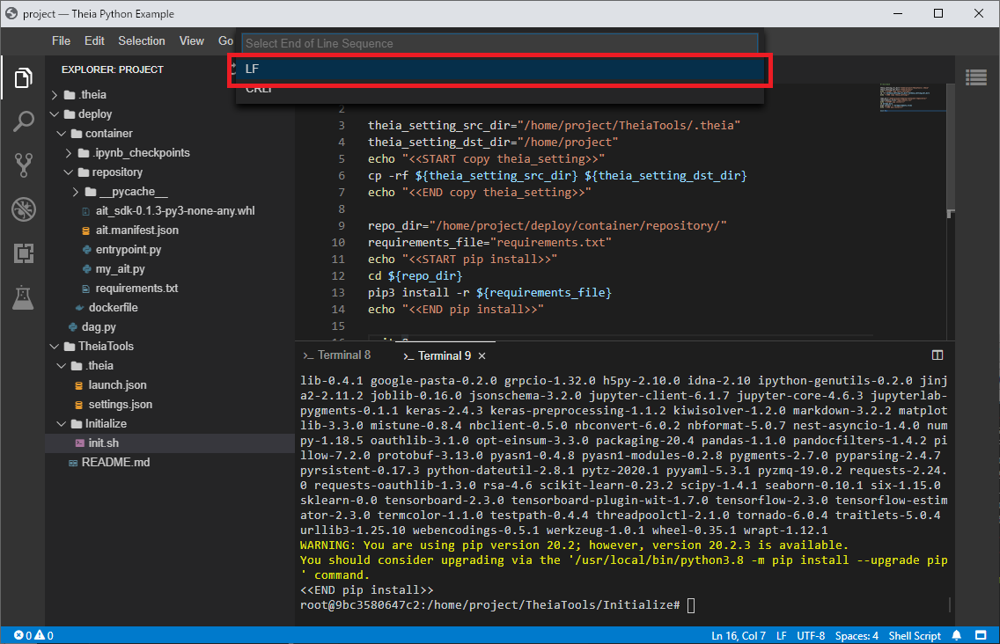

# Deploy

## edit dockerfile

* You write install package.

``` important:: If you need additional software, such as GCC, you will need to include it in your dockerfile.
```

* dockerfile file path

    ```
    {AIT_ROOT}\deploy\container\dockerfile
    ```

* Do not edit `dockerfile_license`. This is used by create thirdparty notice.

## test for theia

### run init.sh in theia

```
cd /home/project/TheiaTools/Initialize/
./init.sh
```



* if this message show, init.sh change CRLF -> LF and save.
```
bash: ./init.sh: No such file or directory
```





### ait execution

* select `DEBUG` and click `run`

    

* if run success, result output `{AIT_ROOT}\local_qai\mnt\ip\job_result\1\1`.

## build docker image

* execute bat

    ```
    {AIT_ROOT}\tool\docker_deploy.bat
    ```

## create thirdparty notice

``` important:: This script may not work perfectly.
Please check yourself to see if your third-party OSS license is listed.
```

* execute bat

    ```
    {AIT_ROOT}\tool\generate_thirdparty_notices.bat
    ```

## build AIT

``` important:: Qunomon system must be booted before running this batch file.
```

``` important:: If you execute this batch file, the procedure of "3.6.Test" is not necessary.
```

* execute bat

    ```
    {AIT_ROOT}\tool\ait_deploy.bat
    ```
