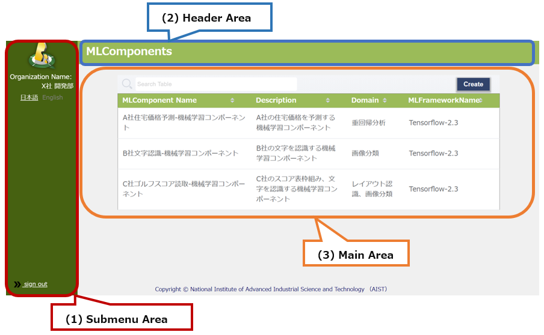

# MLComponents

Screen to display all MLComponents

## All areas

* All areas

  

  * (1) Submenu area

    * a. Sign-in Information Display
    * b. Language Switching (Japanese / English)
    * c. Sign-out

  * (2) Header Area

    * a. Title display

  * (3) Main Area

    * a. MLComponent List Display
    * b. Table Search
    * c. Table Sort
    * d. MLComponent Create

## Main Area

* Main Area

  

  * (1) MLComponent List Display

    * Display all created MLComponents
    * Display MLComponent information

  * (2) Table Search

    * Search in real-time by typing the character
    * The search target is all the information displayed in the table

  * (3) Table Sort

    * When you press the column name of the table, the pressed column name is sorted.

  * (4) MLComponent Create

    * When you press the button, the MLComponent creation modal is displayed.
