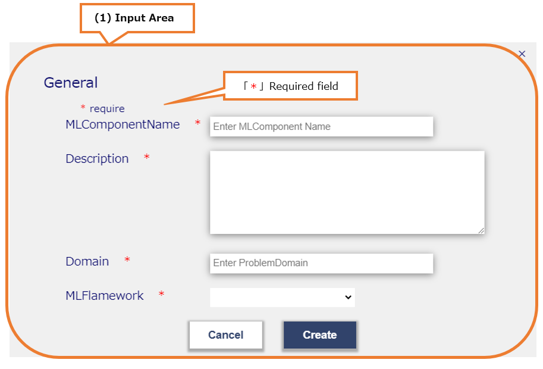

# MLComponentsCreate

Modal to create MLComponen

## MLComponentsCreateModal

* MLComponentsCreateModal

  

  * (1) Input area

    * a. data input
    * b. Input Cancel or Create
    * c. Close modal screen

  * (2) [*]

    * [*] is a required item
