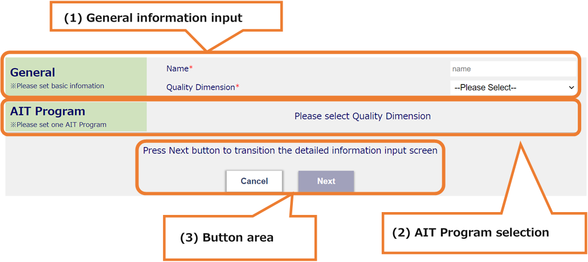
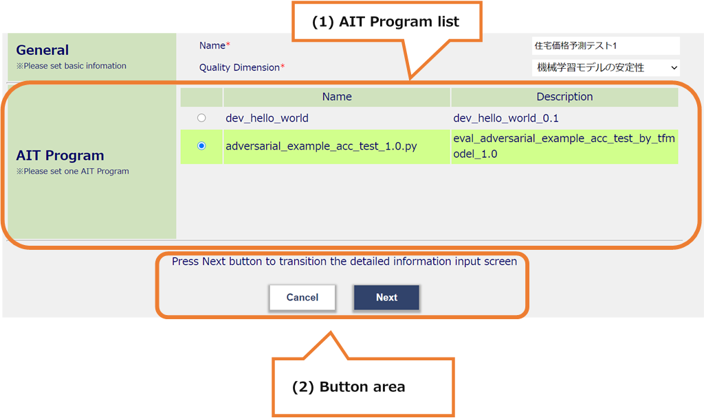
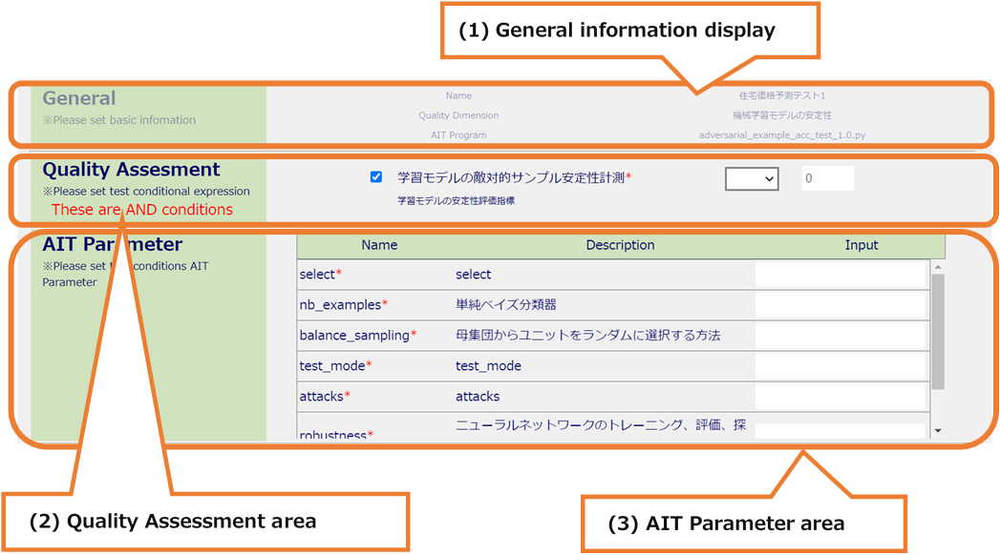
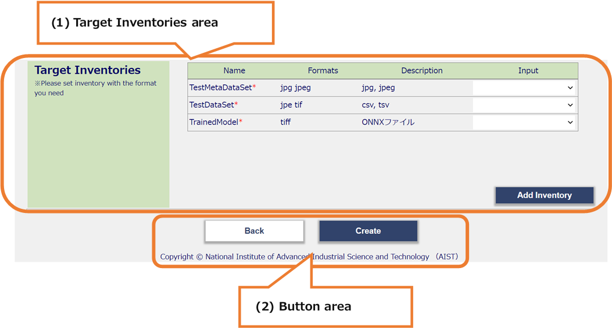

# TestDescriptionsCreate

Screen for creating Test Description (2 screens)

## All areas

* All areas

  

  * (1) Submenu area

    * a. Sign-in Information Display
    * b. Language Switching (Japanese / English)
    * c. Inventories
    * d. TestDescriptions
    * e. Display Contents
    * f. MLComponents
    * g. Sign-out

  * (2) Header area
    * a. MLComponent name display

  * (3) Main area
    * a. General information input
    * b. AIT Program information input
    * c. Transition to the information input second screen

## Main Area

* Main Area (first screen)

  

  * (1) General information input

    * First, select the name and Quality Dimension you want to register as general information.

  * (2) AIT Program selection

    * Initially not displayed, after selecting Quality Dimension, the associated AIT Program table is displayed.

  * (3) Button area

    * Press Next to move to the second screen for entering information.　After entering all the items, this button will be activated and can be pressed.

    * If you press Cancel, you can move to the Test Descriptions screen.

* Main Area (first screen, After selecting Quality Dimension)

  

  * (1) AIT Program list
    * After selecting Quality Dimension, the AIT Program table is displayed.
    * The AIT Program you want to register is determined by clicking the radio button.

  * (2) Button area
    * Press Next to move to the second screen for entering information.　After entering all the items, this button will be activated and can be pressed.
    * If you press Cancel, you can move to the Test Descriptions screen.

* Main Area (second screen, first half)

  

  * (1) General information display
    * It is possible to check the registered information on the first screen.

  * (2) Quality Assessment area
    * It is possible to set the Quality Assessment information you want to register.
    * If you check the check box, you can enter it.
    * If there are multiple items, the test pass condition is in the relationship of "&".
    * After confirming the item name and detailed information, it is possible to set the test pass condition by selecting the relational operator in the select box and entering the value.
    * If the check box is unchecked, it becomes inactive and can be registered as not subject to the test pass conditions.

  * (3) AIT Parameter area
    * It is possible to set the information of the AIT Parameter you want to register.
    * Check the name and detailed information, and enter the input value.
    * If there are many display items, it is possible to scroll.

* Main Area  (second screen, second half)

  

  * (1) Target Inventories area

    * Select the Target Inventory you want to register.
    * Check the name, format, and detailed information, and select Inventory.
    * If there are many display items, it is possible to scroll.
    * If there is no Inventory that matches the format, it is possible to add an Inventory by pressing the Add Inventory button(+) to display the Add Inventory modal.

  * (2) Button area
    * It is possible to create Description by pressing the Create button.
    * If there is an input error, an error message will be displayed at the top of the screen.
    * It is possible to return to the first screen by pressing the Back button.
