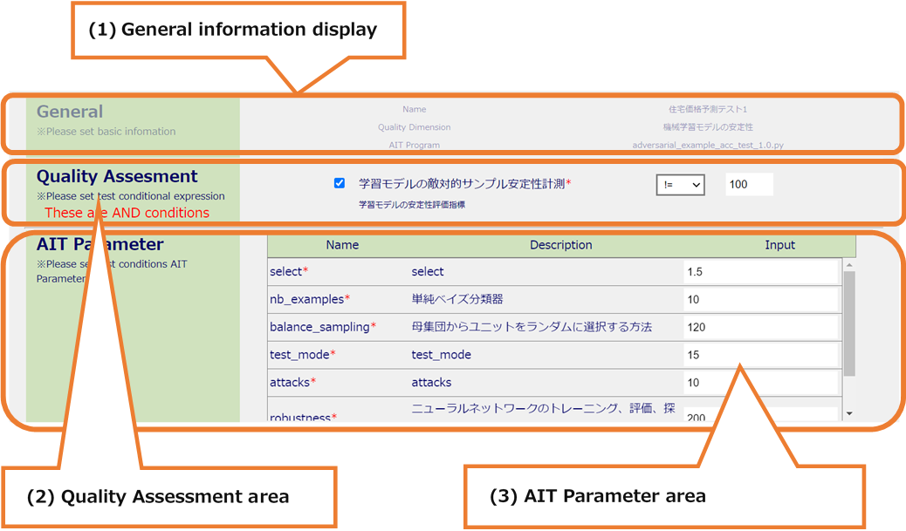
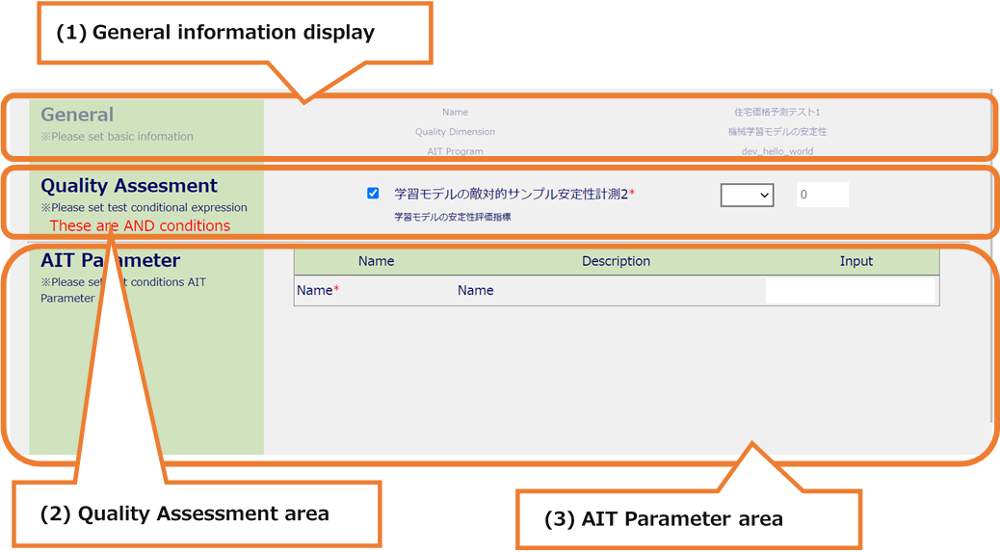

# TestDescriptionsEdit

Screen for editing the created TestDescription (2 screens)

## All areas

* All areas

  

  * (1) Submenu area

    * a. Sign-in Information Display
    * b. Language Switching (Japanese / English)
    * c. Inventories
    * d. TestDescriptions
    * e. Display Contents
    * f. MLComponents
    * g. Sign-out

  * (2) Header area
    * a. MLComponent name display

  * (3) Main area
    * a. General information edit
    * b. AIT Program information edit
    * c. Transition to the information input second screen

## Main Area

* Main Area (first screen)

  

  * (1) General information editing
    * It is possible to edit the name and the Quality Dimension.

  * (2) AIT Program list
    * If you do not change the Quality Dimension, the AIT Program table is displayed and the selected AIT Program is checked.
    * If you change the Quality Dimension, you can activate and select it by clicking the radio button of the AIT Program you want to register.

  * (3) Button area
    * After entering all the information, the Next button will be activated.
    * It is possible to move to the second screen of information editing by pressing the Next button.
    * If you press the Cancel button, it is possible to transition to TestDescriptions screen.

* Main Area (second screen, first half, no AIT change)

  

  * (1) General information display
    * It is possible to confirm the information registered in the first screen.

  * (2) Quality Assessment area
    * It is possible to set the Quality Assessment information you want to register.
    * The registered information has already been entered.
    * If you check the check box, you can enter it.
    * If there are multiple items, the test pass condition is in the relationship of "&".
    * After confirming the item name and detailed information, you can set the test pass condition by selecting the relational operator in the select box and entering the value.
    * If the check box is unchecked, it becomes inactive and can be registered as not subject to the test pass conditions.

  * (3) AIT Parameter area
    * It is possible to set the information of the AIT Parameter you want to register.
    * The registered information has already been entered.
    * Check the name and detailed information, and enter the input value.
    * If there are many display items, it can be scrolled.

* Main Area (second screen, second half, no AIT change)

  

  * (1) Target Inventories area
    * Select the Target Inventory you want to register.
    * The registered information is displayed.
    * Check the name, format, and detailed information, and select Inventory.
    * If there are many display items, it is possible to scroll.
    * If there is no Inventory that matches the format, it is possible to add an Inventory by pressing the Add Inventory button(+) to display the Add Inventory modal.

  * (2) Button area
    * It is possible to update the Description by pressing the Update button.
    * If there is an input error, an error message will be displayed at the top of the screen.
    * If you press the Back button, it is possible to return to the first screen.

* Main Area (second screen, first half, AIT change)

  

  * (1) General information display
    * It is possible to confirm the information registered in the first screen.

  * (2) Quality Assessment area
    * It is possible to set the Quality Assessment information you want to register.
    * If you check the check box, you can enter it.
    * If there are multiple items, the test pass condition is in the relationship of "&".
    * After confirming the item name and detailed information, you can set the test pass condition by selecting the relational operator in the select box and entering the value.
    * If the check box is unchecked, it becomes inactive and can be registered as not subject to the test pass conditions.

  * (3) AIT Parameter area
    * It is possible to set the information of the AIT Parameter you want to register.
    * Check the name and detailed information, and enter the input value.
    * If there are many display items, it can be scrolled.

* Main Area (second screen, second half, AIT change)

  

  * (1) Target Inventories area
    * Select the Target Inventory you want to register.
    * Check the name, format, and detailed information, and select Inventory.
    * If there are many display items, it is possible to scroll.
    * If there is no Inventory that matches the format, it is possible to add an Inventory by pressing the Add Inventory button(+) to display the Add Inventory modal.

  * (2) Button area
    * It is possible to update the Description by pressing the Update button.
    * If there is an input error, an error message will be displayed at the top of the screen.
    * If you press the Back button, it is possible to return to the first screen.
    * If you return with the Back button, the information before the change has been entered.
