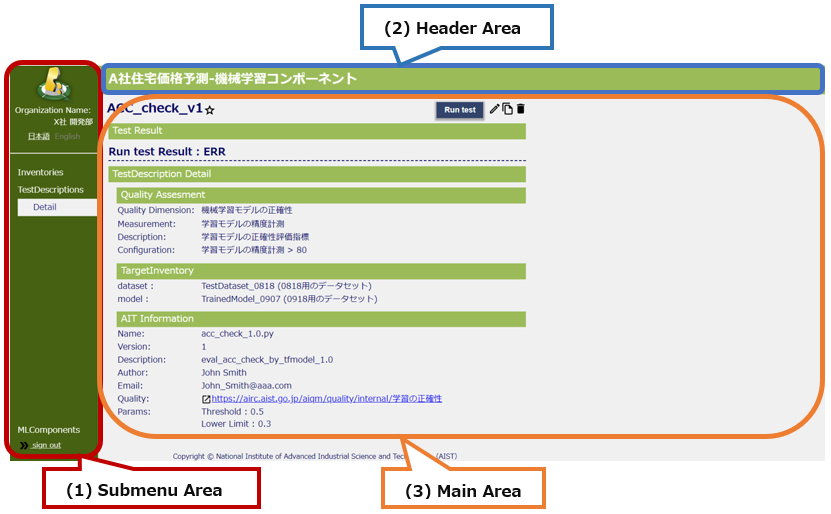
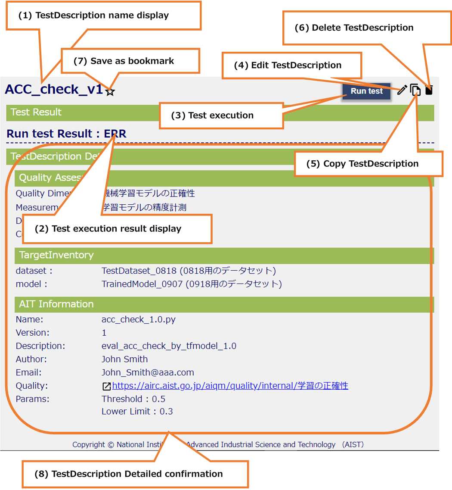
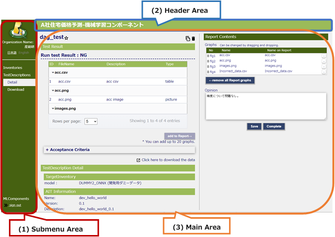
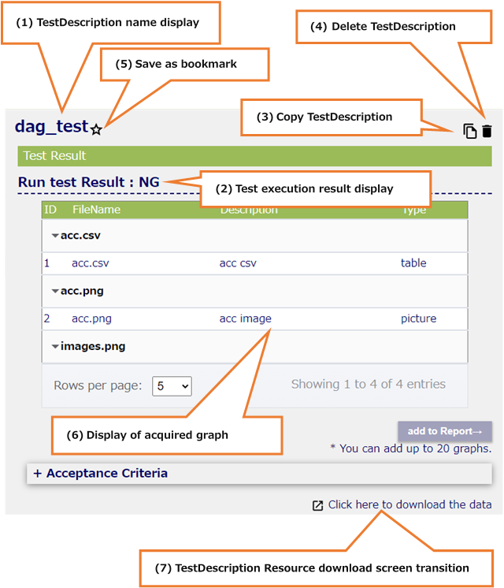
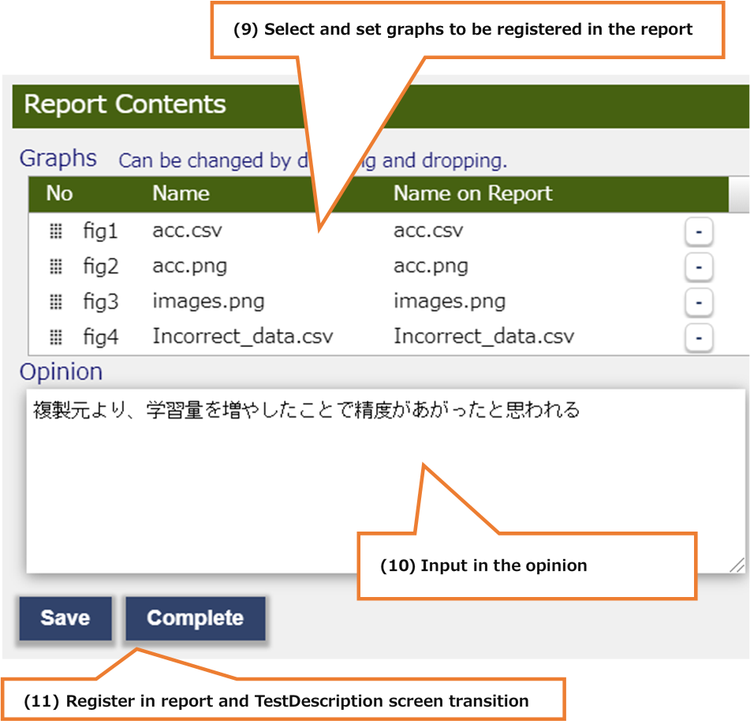
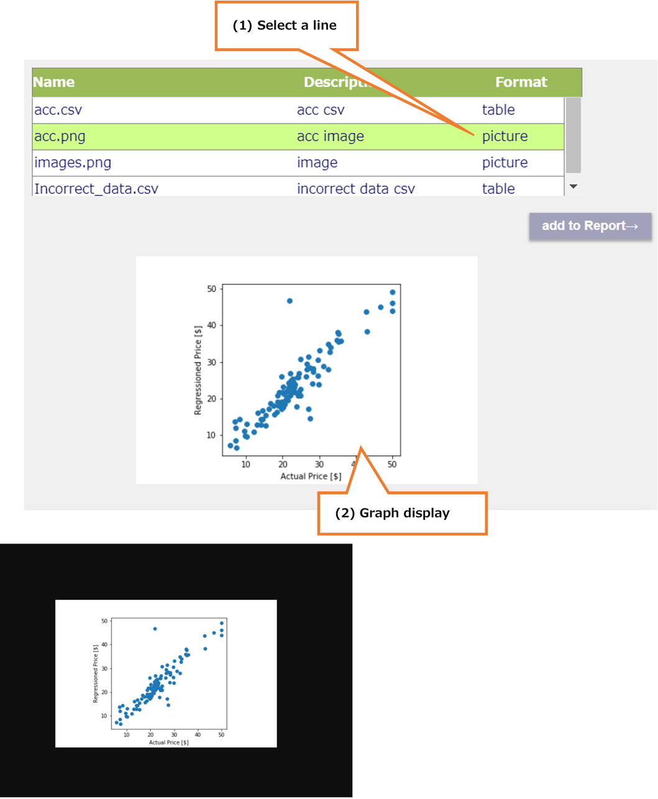
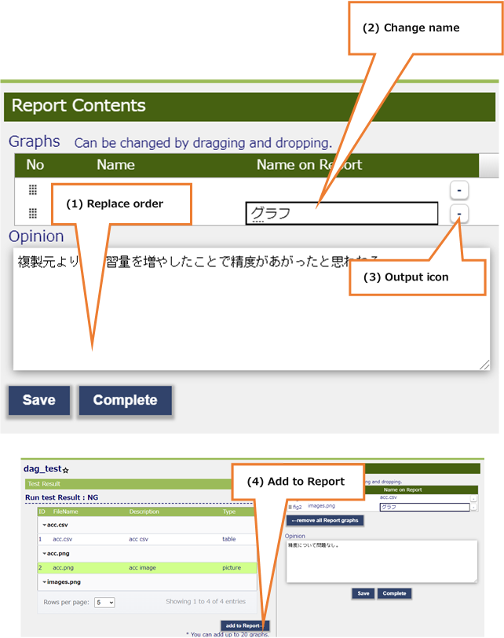

# TestDescriptionsDetail

Check the test details of the Test Description selected on the Test Descriptions screen.
For the test carried out already TestDescription, it is possible to determine the components to be registered to report.

## All areas (Test not performed, or Test result is ERR)

* All areas (Test not performed, or Test result is ERR)

  

  * (1) Submenu area
    * a. Sign-in Information Display
    * b. Language Switching (Japanese / English)
    * c. Inventories
    * d. TestDescriptions
    * e. MLComponents
    * f. Sign-out

  * (2) Header area
    * a. Display the MLComponent name selected on the MLComponent screen

  * (3) Main area
    * a. TestDescription name display
    * b. Test execution result display
    * c. Test execution
    * d. Edit TestDescription
    * e. Copy TestDescription
    * f. Delete TestDescription
    * g. Save as bookmark
    * h. TestDescription Detailed confirmation

## Main area (Test not performed, or Test result is ERR)

* Main area (Test not performed, or Test result is ERR)

  

  * (1) TestDescription name display
    * TestDescription name selected on the TestDescriptions screen is displayed.

  * (2) Test execution result display
    * The execution result of the TestDescription selected on the TestDescriptions screen is displayed.

  * (3) Test execution
    * When the button is pressed, the Test Description test is executed.

  * (4) Edit TestDescription
    * When the icon is pressed, a transition to the edit screen.

  * (5) Copy TestDescription
    * When the icon is pressed, a transition to the copy screen.

  * (6) Delete TestDescription
    * When the icon is pressed, TestDescription is deleted.

  * (7) Save as bookmark
    * It is possible to register and cancel favorites by pressing the icon.

  * (8) TestDescription Detailed confirmation
    * QualityAssesment and TargetInventory and AIT is displayed of TestDescription

## All areas (Test result is OK or NG)

* All areas (Test result is OK or NG)

  

  * (1) Submenu area
    * a. Sign-in Information Display
    * b. Language Switching (Japanese / English)
    * c. Inventories
    * d. TestDescriptions
    * e. MLComponents
    * f. Sign-out

  * (2) Header area
    * a. Display the MLComponent name selected on the MLComponent screen

  * (3) Main area
    * a. TestDescription name display
    * b. Test execution result display
    * c. Copy TestDescription
    * d. Delete TestDescription
    * e. Save as bookmark
    * f. Display of acquired graph
    * g. TestDescription Resource download screen transition
    * h. TestDescription Detailed confirmation
    * i. Select and set graphs to be registered in the report
    * j. Input in the opinion
    * k. Register in report and TestDescription screen transition

## Main area (Test result is OK or NG)

* Main area (Test result is OK or NG)

  

  * (1) TestDescription details
    * Confirm the details and execution results of TestDescription

  * (2) Report Contents
    * Set the items to be output to the report

## Main area details (Test result is OK or NG)

* Main area details (Test result is OK or NG)

  

  * (1) TestDescription name display
    * TestDescription name selected on the TestDescriptions screen is displayed.

  * (2) Test execution result display
    * The execution result of the TestDescription selected on the TestDescriptions screen is displayed.

  * (3) Copy TestDescription
    * When the icon is pressed, a transition to the copy screen.

  * (4) Delete TestDescription
    * When the icon is pressed, TestDescription is deleted.
    * If there is a copy of this TestDescription, it will be deleted at the same time.

  * (5) Save as bookmark
    * It is possible to register and cancel favorites by pressing the icon.

  * (6) Display of acquired graph
    * A graph of the test results of the Test Description selected on the Test Descriptions screen is displayed.
    * (* See details 8.1.6)

  * (7) TestDescription Resource download screen transition
    * Screen to download the Resource at the time of TestDescriptions execution is opened in another tab.

  

  * (8) TestDescription detailed display
    * The Quality Assessment, Target Inventory and AIT of the Test Description selected on the Test Descriptions screen are displayed.
    * Quality Assessment can open and close details by pressing the title

  

  * (9) Select and set graphs to be registered in the report
    * Select the graph to be output to the report and change the output order and the output name.
    * (* See details 8.1.7)

  * (10) Input in the opinion
    * Enter the opinion on the result of this TestDescription.
    * The entered content is output to the report.

  * (11) Register in report and TestDescription screen transition
    * "Save"：Save graphs and opinions to be output to the report
    * "Complete"：Save the graph and opinions to be output to the report, and Transit to the Test Descriptions screen.

## Graph details

* Graph details

  

  * (1) Select a line
    * Select a line whose format is “picture”, a graph is displayed below the table.
    * (Nothing is displayed when “css” is selected)

  * (2) Graph display
    * Clicking on the graph, the graph is displayed in its original size in another tab

## Report Contents details

* Report Contents details

  

  * (1) Replace order
    * Dragging and dropping the icon, it is possible to replace the order of output to the report.

  * (2) Change name
    * Double-click a cell in the “Name on Report” column, it is possible to set the output name for the report.

  * (3) Output icon
    * When the icon is pressed, it is not output to the report

  * (4) Add to Report
    * If you select a graph not in the right table in the left table, "add to Report" will be activated and you can add it to the right table.
