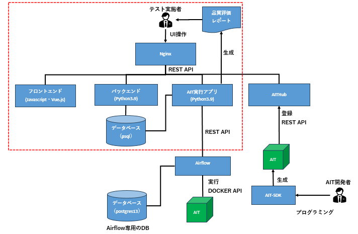

# システム構成

本ガイドの説明する範囲は以下図の赤点線枠内です。



* フロントエンド

フォルダーは{\qunomon\src\frontend}が該当します。

開発はJavascript（Vue.js）を利用します。

* バックエンド

フォルダーは{\qunomon\src\backend}が該当します。

開発はPython3.9を利用します。

* AIT実行アプリ

フォルダーは{\qunomon\src\integration-provider}が該当します。

開発はPython3.9を利用します。

* データベース

フォルダーは{\qunomon\src\storage}が該当します。

* Nginx

フォルダーは{\qunomon\src\reverse-proxy-resty-local}が該当します。

``` tip:: 各アプリ毎のフォルダ構成は「4.アプリ毎のフォルダ構成」を参照してください。
``` 