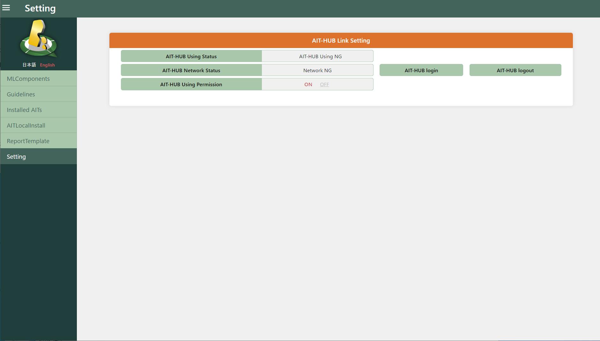
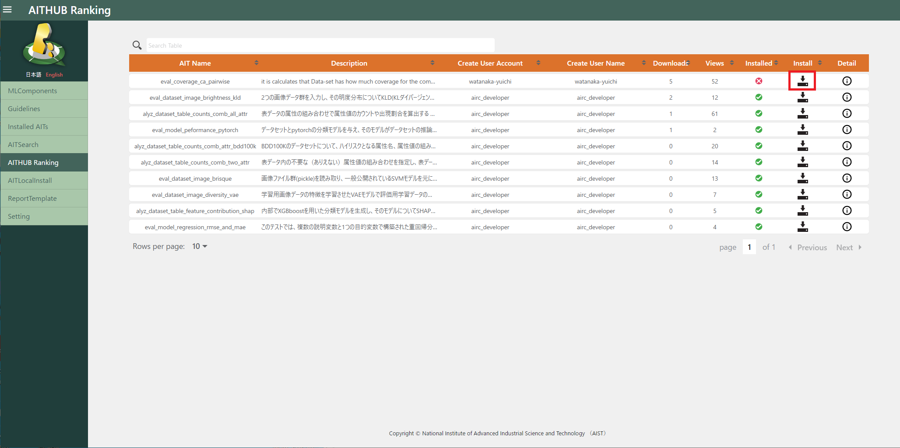
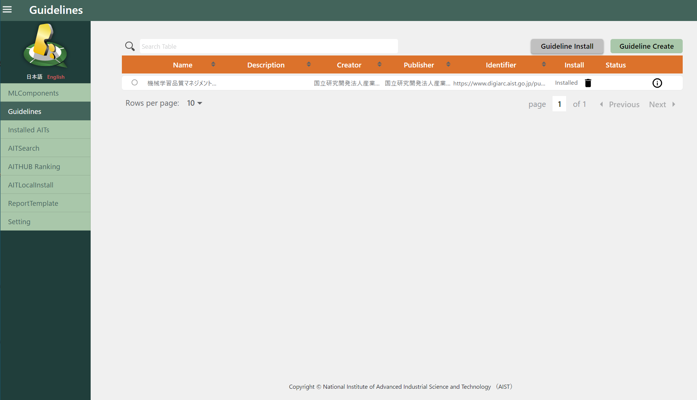
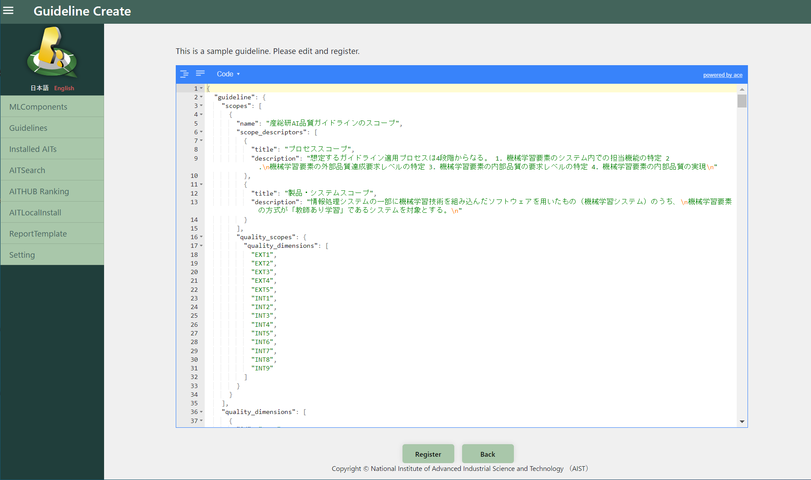

# Preparation

Qunomon uses AIT (AI Test package), an executable AI/ML evaluation method, to evaluate and assure the ML components under test according to the guideline/standards adopted by your organization. 

Qunomon comes with several AITs and guideline definitions from the beginning, but you will need to install new AITs and guideline definitions according to your ML components under test and organization's quality policies.

To install these new packages, there are two main different ways: (1) Search and install packages through AIT Hub which is hosted by the AIST for sharing AITs and guideline definitions. (2) Locally install manually created AITs and guideline definitions (actually a JSON file).

## Install new packages through AIT Hub

### Preparation: establish a connection with AIT Hub

Click the "AIT-HUB login" button on the Setting screen on your Qunomon.

### Install and register a new guideline definition

You can see the list of guideline which can be installed to your Qunomon from the "Guidelines" screen.
Choose guideline to be installed with radio button, and then click the "Guideline install" button.

### Install and register a new AIT

You can see the list of published AITs through "AITSearch" screen. You can filter the AITs to be listed by search boxes diplayed at top of the screen.

If you want to know more detailed information (such like authors, detailed description, I/O requirements...) of the AIT, you can press the icon displayed on the "Detail" column on the table to see them.

If the "×" mark are displayed on the "Installed" column, they are AITs currently not installed. Please check the detail and install them as needed. Choose an AIT to be installed with radio button, and then click the icon on the "Install" column. This will automatically download the selected AIT from AIT Hub and registration to your Qunomon.

Alternatively, you can check and install popular AITs from "AITHub Ranking" screen.

## Local Installation (without AIT Hub)
If you want install AITs and/or guideline definitions locally because you have created the new AIT, your organization adopted a private guideline/standards, etc., please read this section. 

These procedure are for advanced users and may require some computer science knowledge.

### Register Guideline (not using AIT-HUB)

You must analyze guideline/standards and identify quality characteristics defined in them. After that, you required to write "Guideline JSON" conform to our [Guideline Schema](https://github.com/aistairc/qunomon/tree/dev2_schema/schema/doc/guideline_schema/develo) defined as JSON Schema.

Click the "Guideline Create" button on the "Guidelines" screen.

A sample of guideline definition compliant with the schema will be displayed on the "guideline creation" screen. Modify them accordingly and click the "Register" button.

If you want modify them over a wide range, it is advised to read guideline schema carefully and edit them on the other editors. We recommend that you test your guideline JSON for schema compliance beforehand.

### Register AIT (not using AIT-HUB)

Move to the "AITLocalInstall" screen. Press the "Select Upload File" and then you are choose zipped AIT to be installed. "AIT Create" button will register the AIT into your Qunomon.

To create AIT and its zipped archive, you should read [AIT Development Guide](https://aistairc.github.io/qunomon/ait-guide/index.html) as reference.

