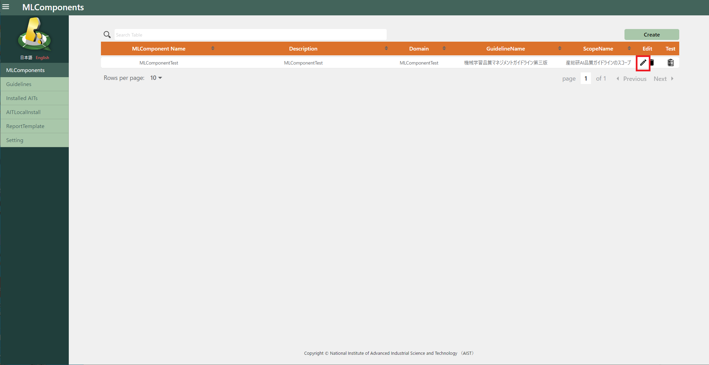
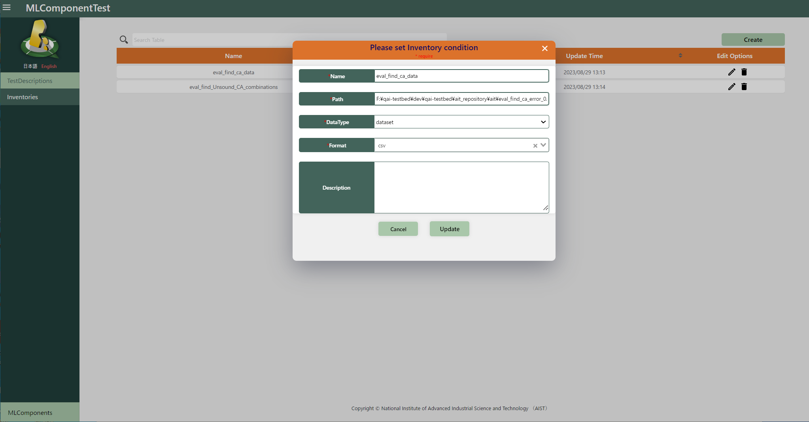
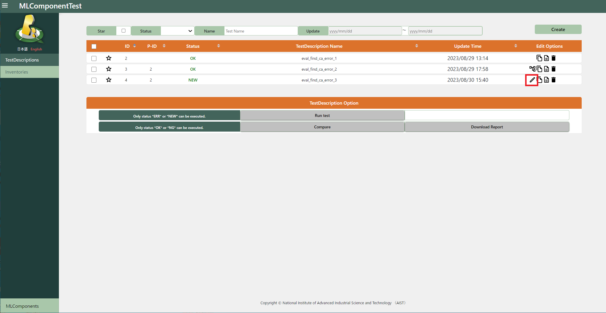
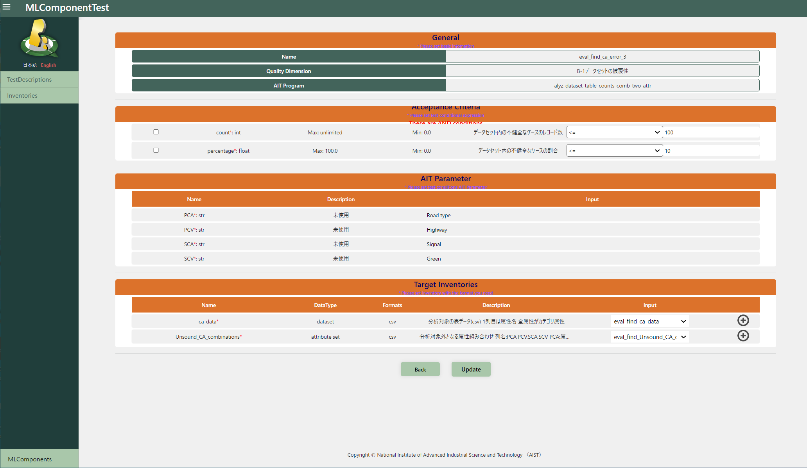

# Modification

## Modification MLComponents

Clicking the "edit" icon on the MLComponents list screen to move to the edit screen.

Edit and click the "Update" button to update.

## Modification Inventories

Clicking the "edit" icon on the Inventories list screen to move to the edit screen.

Edit and click the "Update" button to update.

## Modification TestDescriptions

Clicking the "edit" icon on the TestDescriptions list screen to move to the edit screen.

(The "edit" icon is displayed only before execution or ERR of TestDescription.)

Edit the basic information in TestDescription and click the "Next" button.

Edit the detailed information in TestDescription and click the "Update" button to update it.

