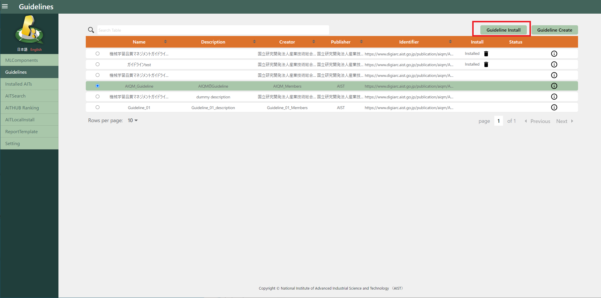
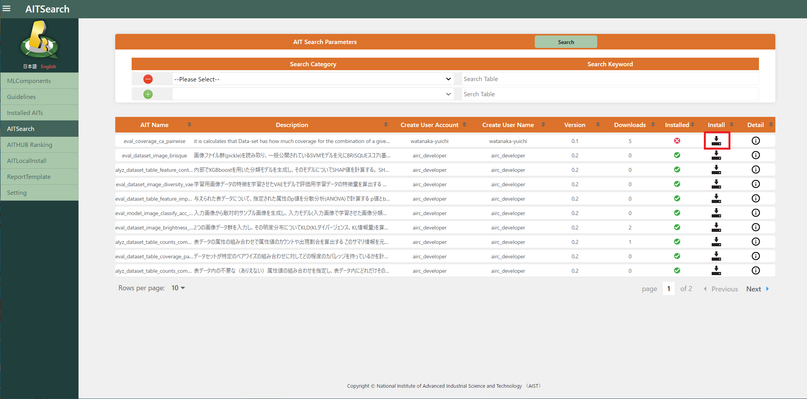
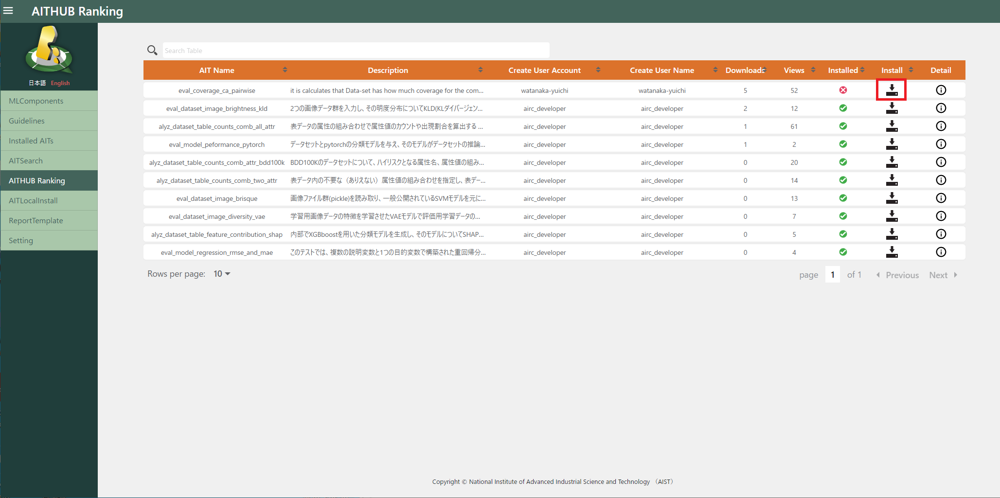
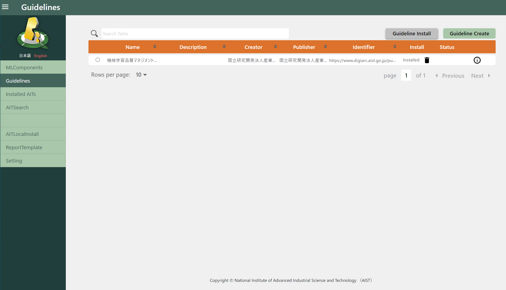
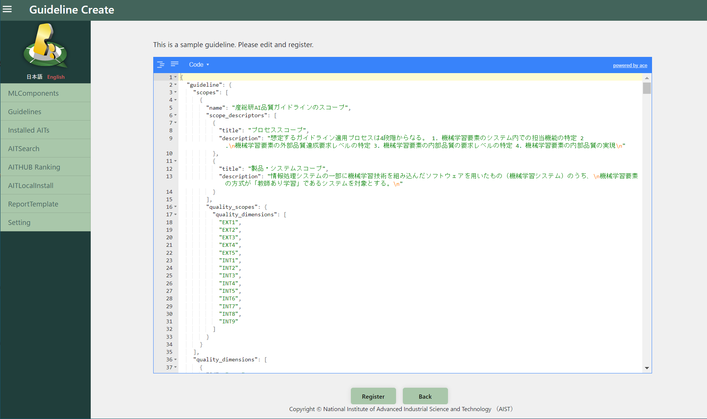
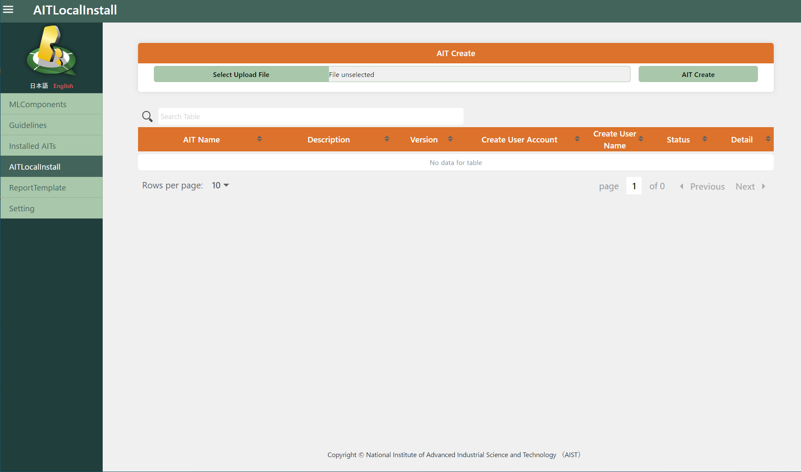

# 事前準備

Qunomonは、実行可能な品質評価手法のパッケージであるAIT (AI Test package) を用いて、利用者の組織が採用している品質文書、ガイドラインや標準に対応した評価を行います。

初期状態のQunomonにも少数のAITとガイドラインがプレインストールされていますが、これらはサンプルですので、評価実施前にご自身の必要とするAITやガイドラインをQunomonにインストールする必要があります。

インストールは大きく二つの方法に分かれます。(1) 産総研が公開するWebサービスであるAIT Hubを用いて検索・インストールする方法と、(2) 評価者の組織で作成したAITやガイドラインJSONファイルをローカル上で読み込んでインストールする方法です。本章では両者の手順を紹介します。

## AIT Hubを利用する場合

この手順では、AIT Hub上に登録されているAITやガイドラインをQunomonにダウンロード・登録します。

### AIT Hubに接続

Setting画面で「AIT-HUB login」ボタンを押下してログイン状態にします。

### ガイドライン登録

Guidelines画面に遷移して、インストールしたいガイドラインの行のラジオボタンを選択し「Guideline install」ボタンでインストールします。Install列を見ると、当該ガイドラインが既にインストールされているかどうかを判別できます。

### AIT登録

AITSearch画面に遷移して、上部検索画面を用いてAITの絞り込みを行います。
検索結果が下部の表に一覧表示されますので、内容を確認してください。最右列「Detail」のアイコンを押下することで、AITの詳細情報（名称、作者、概要、入出力形式等を含みます）を閲覧することができます。

Installed列に×が表示されているAITは、未インストールのAITです。詳細を確認して、必要だと思ったAITをインストールしましょう。Install列に表示されたアイコンをクリックすると、AIT Hubからのダウンロード、およびお手元のQunomonへの登録が自動で実行されます。

※インストール済のAITを再度インストールすることはできません。必要な場合は、Installed AITs画面に遷移して、削除してから再インストールしてください。

AITHub Ranking画面から、人気のAITをインストールすることもできます。
表の見方、インストールの仕方、制約等はAIT Search画面と変わりません。

## AIT Hubを利用しない場合
自身で作成した、あるいは組織内でのみ共有されているなどの理由から、AITやガイドラインがAIT Hubに登録されていない場合、ローカル上でのみインストールすることができます。

### ローカルからのガイドライン登録

ガイドライン・標準に定義された品質特性等を、ガイドラインJSON形式で記述し、その内容を登録してもらう必要があります（上級者向け）。
ガイドラインJSONは、[ガイドラインスキーマ](https://github.com/aistairc/qunomon/tree/dev2_schema/schema/doc/guideline_schema/develop)に従って記述する必要があります。

Guidelines画面で「Guideline Create」ボタンを押下してガイドライン作成画面に遷移します。

ガイドライン作成画面にガイドラインJSONのサンプルとして産総研機械学習品質マネジメントガイドラインのガイドラインJSONが表示されます。本画面で必要な部分を適宜修正して「Register」ボタンを押下して登録します。

大きく編集したい場合は、別途ガイドラインスキーマを精読したうえで、別のエディタで編集したものを貼り付けてもらうこともできます。このとき、記述したガイドラインJSONがスキーマに適合するかどうかを事前検証しておくことを推奨します。

### ローカルからのAIT登録

AITLocalInstall画面に遷移します。「Select Upload File」ボタンを押下してAITのzipファイルを選択し、「AIT Create」ボタンで登録します。
AITのzipファイルの作成方法については、別途[AIT開発ガイド](https://aistairc.github.io/qunomon/ait-guide/index.html)を参考にしてください。

