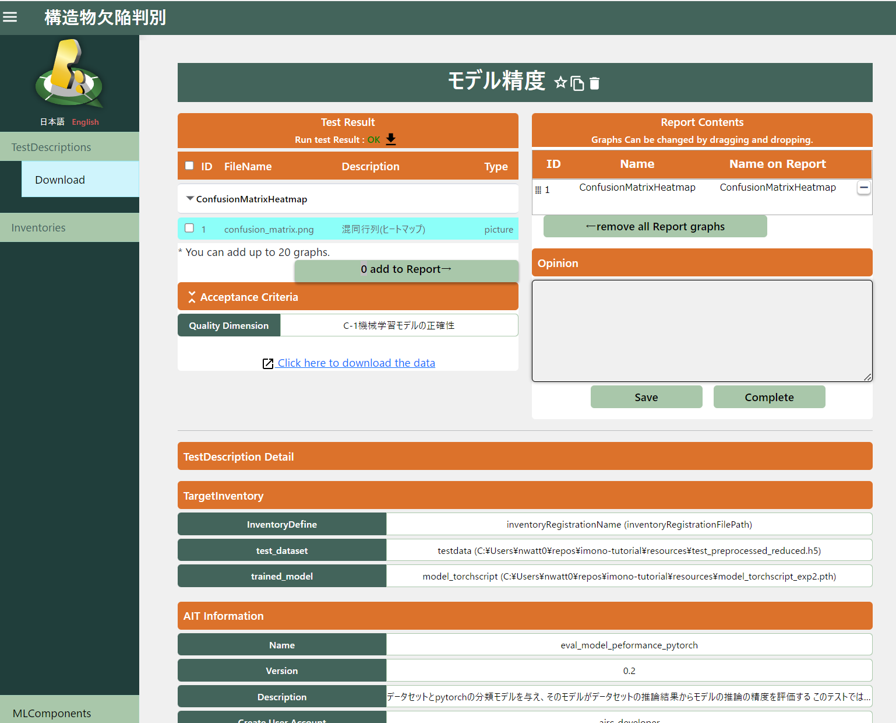

# 実行

## レポートテンプレート登録（任意）

オリジナルのレポートテンプレートを登録することができます。

（テンプレート無しでもレポート出力することができるので必須の作業ではありません。）

### レポートテンプレート作成

#### 独自にレポートテンプレートを作成する場合

テンプレートのサンプルが以下フォルダに存在していますので、コピーして編集してzipに圧縮してください。

qunomon\src\backend\report\templates\1

#### ガイドラインからレポートテンプレートを作成する場合

ReportTemplate画面の「Create Report Template」部分でガイドラインを選択して「Create」ボタンを押下してください。

### レポートテンプレート登録

ReportTemplate画面の「Install Report Template」部分で、関連付けるガイドラインを選択して、テンプレート名を入力して、zipにしたテンプレートファイルをアップして、「install」ボタンを押下してください。

## MLComponents登録

MLComponentは、機械学習モデル1つを表す単位です。

MLComponents画面から「Create」ボタンを押下してMLComponent新規作成画面を表示させます。

MLComponent新規作成画面で必要項目を入力して「Create」ボタンを押下してください。

MLComponentName：MLComponentの名前

Description：MLComponentの説明

Domain：MLComponentの領域・分野

Guideline：使用するガイドラインを選択

Scope：ガイドラインで使用するスコープを選択

MLComponents画面の一覧に作成されたMLComponentが表示されるので「test」アイコンを押下してください。

## Inventories登録

InventoryはAITで使用する機械学習モデルやCSVのようなデータの情報を管理する機能です。

基本的にInventory登録画面から登録しますが、TestDescriptions登録画面からも登録できます。

サブメニューから「Inventories」を押下してInventory一覧画面が表示されるので、「Create」ボタンを押下してください。

Inventory新規作成画面で必要項目を入力して「Create」ボタンを押下してください。

Name：Inventoryの名前

Path：Inventory実体を保存しているファイルパス

DataType：「dataset」「model」「attribute set」のいずれかを選択（AITが使用するInventoryのタイプと同じタイプにしておく必要がある）

Format：ファイルの拡張子を選択（選択肢に無い形式の場合は直接入力）

Description：Inventoryの説明

## TestDescriptions登録

TestDescriptionはQunomon上で実行されるテストの単位です。

TestDescription画面の「Create」ボタンを押下して作成画面に遷移します。

TestDescriptionの基本情報を入力して「Next」ボタンを押下します。

General→Name：TestDescriptionの名前

AIT Program：使用するAITを選択（「Name」や「Description」で絞り込めます）

Quality Dimension：AITが測定する品質を選択

TestDescriptionの詳細情報を入力して「Create」ボタンを押下します。

Acceptance Criteria：AITの評価値を入力（TestDescription実行時にこの数式を全部満たせば、TestDescription実行結果はOKになる）

AIT Parameter：AITのパラメータを入力

Target Inventories：AITが使用するインベントリを指定する（Inventories登録はここの「＋」アイコンでも登録可能）

正常に登録されると、TestDescription一覧に追加されます。

## TestDescriptions実行

実行するTestDescriptionを選択して、「Run test」で実行します。

終了すると、選択したTestDescriptionのStatusが変化します。

OK：Acceptance Criteriaを満たせた場合

NG：Acceptance Criteriaを満たせなかった場合

ERR：TestDescriptionsが実行できなかった場合

* ERRの原因調査の方法

(1) ERRとなったTestDescriptionの詳細画面でエラー内容を確認

(2) qai-testbed\qunomon\logsのログファイルを確認

(3) airflowのログを確認

http://localhost:8180/home　でTestDescriptionで使用したAITのログを確認

（ID：airflow　PASS：airflow）

## TestDescriptions詳細表示

対象のTestDescriptionの詳細アイコンを押下します

Test Resultの出力ファイルを選択すると内容を表示できます。

Report Contentsは出力ファイルをレポート内に含めるか否かを設定できます。

Opinionはレポートに総評を追記できます。

サブメニューの「Download」を押下するか、「Click here to download the data」を押下すると、Download画面に遷移します。

## リソースをダウンロード

ダウンロードアイコンを押下するとファイルをダウンロードできます。

## TestDescriptionsコピー

TestDescription一覧画面で、TestDescriptionsのコピーアイコンを押下すると、内容をコピーして作成できます。

「Name」や「Acceptance Criteria」や「AIT Parameter」や「Target Inventories」を編集して「Create」ボタンを押下します。

TestDescription一覧画面に追加されます。

コピーしたTestDescriptionを実行すると、「relationsip」アイコンが表示され、押下するとTestDescriptionの親子関係が表示できます。

## TestDescriptions比較

親子関係のあるTestDescriptionを２つ選択して「Compare」ボタンを押下すると、比較画面に遷移できます。

出力ファイルを選択すると画面表示ができます。

## レポート出力

TestDescriptionを選択して「Download Report」ボタンを押下すると、レポート出力することができます。

レポートテンプレート選択画面で、作成したテンプレートを選択して「Preview」ボタンを押下すると、テンプレートを使用したレポートのプレビューが表示れます。

もしくは、「Do not use ReportTemplate」を選択して「Preview」ボタンを押下すると、テンプレートを使用しないレポートのプレビューが表示れます。

「Report Opinion」で入力した文字列がレポートの総評に反映されます。

「Create」ボタンを押下するとレポートがPDF形式でダウンロードされます。

