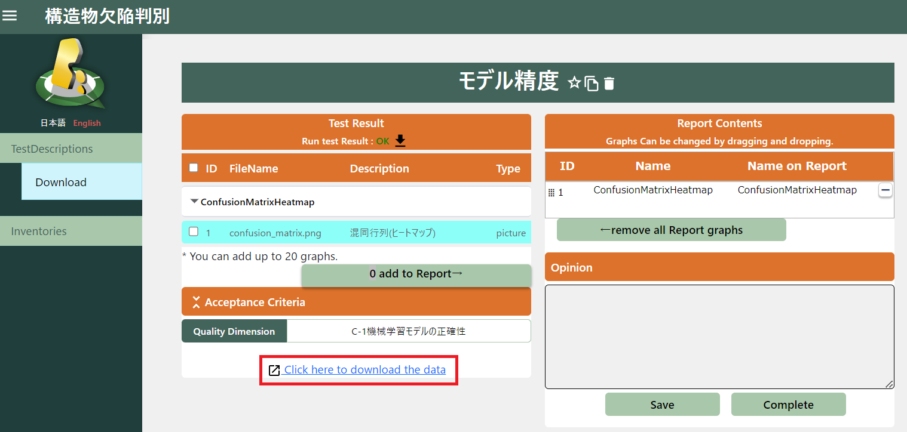

# 品質評価の実行

本章では、Qunomonを用いた機械学習コンポーネントの評価手順を解説します。

以降、Qunomonにおける評価単位である機械学習コンポーネントの登録にはじまり、機械学習コンポーネントに紐づくアセット（モデルやデータセット等）の登録、テスト仕様の登録、テストの実行、結果確認、品質評価レポートの出力という流れで説明を行います。

## MLComponentの登録

Qunomonでは、システムの品質をMLComponentという単位で評価します。

MLComponentは、（機械学習システムを構成する）コンポーネントのうち、機械学習部分を含む1つの機能的まとまりを表す単位です。典型的には１つまたは複数のモデル・データセットで構成されます。

はじめに、MLComponents画面から「Create」ボタンを押下してMLComponent新規作成画面を表示させてください。

MLComponent新規作成画面に、以下の必要項目を入力して「Create」ボタンを押下してください。

* MLComponentName：MLComponentの名前（他のコンポーネントと区別しやすい名前）
* Description：MLComponentの説明
* Domain：MLComponentの領域・分野（産業分野，ユースケース，タスク種別等）
* Guideline：評価に使用するガイドラインを選択
* Scope：ガイドラインに含まれるスコープのうち、今回の評価に適用されるスコープを選択（一つしかない場合もあります）。

登録後は、MLComponents画面に、作成したMLComponentが表示されます。
以降、作成したMLコンポーネントのインベントリに評価対象資産を登録し、テスト仕様を定義していきます。まずは「Test」列のアイコンをクリックして、登録したMLComponentの詳細画面に遷移しましょう。

## Inventoryの登録

InventoryはMLコンポーネントを構成するアセットのうち、品質評価対象となるものを登録する入れ物になります。Inventoryに格納される品質評価対象には、機械学習モデル（アーキテクチャ、訓練済み重みファイル）やデータセット（CSV, H5, 画像/動画ファイルのリスト）などが含まれます。

サブメニューから「Inventories」を押下してInventory一覧画面が表示されるので、「Create」ボタンを押下してください。

Inventory新規作成画面で必要項目を入力して「Create」ボタンを押下してください。

* Name：Inventoryの名前（自由記述）
* Path：Inventory実体を保存しているローカル・ファイルパス
* DataType：「dataset」「model」「attribute set」のいずれかを選択（AITが使用するInventoryのタイプと同じタイプにしておく必要がある）
* Format：ファイルの拡張子を選択（選択肢に無い形式の場合は直接入力）
* Description：Inventoryの説明（自由記述）

## TestDescriptionの登録

TestDescriptionはQunomon上で実行するテスト（個別の品質評価技術の実行）を記述する最小単位です。品質評価を行うAITや、AITが入力としてとる評価対象資産（Inventories内）を選択してテスト内容を確定します。

TestDescription一覧画面で「Create」列のアイコンを押下してTestDescription作成画面に遷移します。

TestDescriptionの基本情報入力画面です。
下記の情報を入力した後、「Next」ボタンを押下します。

* Name：TestDescriptionの名前（自由記述）
* AIT Program：使用するAIT。インストール済のAITから検索・選択可能です。
  * 「Name」や「Description」で絞り込めます
* Quality Dimension：AITが測定する品質特性を選択
  * ここで表示される品質特性はガイドラインに記載されているものです。Qunomonでは品質をガイドラインに記載の品質特性に紐づけて測定・管理するため、評価者自身が適切なものを選択する必要があります。

TestDescriptionの詳細情報入力画面です。
下記の情報を入力した後、「Create」ボタンを押下します。

* Acceptance Criteria：AITが出力する各評価値について、品質受け入れ基準を入力します。
  * 現在選択中のAITが出力するすべての評価値が表示されています。
  * ここに記載した条件式をすべて満たすとき、テスト成功、そうでないとき、テスト失敗と判定されます。
  * 評価基準は評価者自身がガイドラインやタスクの性質を見て設定する必要があります。
* AIT Parameter：AITが評価者に要求するパラメータの入力欄です。
* Target Inventories：AITの評価対象となる資産を格納したInventoryを選択します。
  * （Inventoriesへの新規登録は本画面の「＋」アイコンからも実施できます）

登録完了後、TestDescription一覧に追加したTestDescriptionが表示されます。

## TestDescriptionの実行

実行するTestDescriptionを選択して、「Run test」で実行します。

終了すると、選択したTestDescriptionのStatusが変化します。

* OK：Acceptance Criteriaを満たせた場合
* NG：Acceptance Criteriaを満たせなかった場合
* ERR：Test Descriptionsが実行できなかった場合（実行時にエラーが発生した場合）

結果がエラーとなった場合は、AIT自体のバグである場合から、Qunomon実行環境のリソース不足、AITに設定したパラメータや評価対象資産のデータ形式不一致など多様な原因が考えられます。
以下にエラー原因の調査方法を示します。

【ERRの原因調査の方法】
* (1) ERRとなったTestDescriptionの詳細画面でエラー内容を確認
* (2) qai-testbed\qunomon\logsのログファイルを確認
* (3) airflowのログを確認
  * http://localhost:8180/home　でTestDescriptionで使用したAITのログを確認
（ID：airflow　PASS：airflow）

## TestDescriptions詳細表示

対象の実行済みTestDescriptionの詳細アイコンを押下して、TestDescriptionの実行結果を確認できます。

次に、TestDescription詳細結果の見方を説明します。

* ①出力されたテストリソースの一覧（画像形式等で出力された結果）です。結果以外に、補足情報等を含む場合があります。
* ②「①」で選択されたリソースをプレビューできます。
* ③リソースのうち、最終的な品質レポートに含めるものを取捨選択できます。
* ④品質評価者自身が、リソースや結果を確認したうえで、本テスト結果についての品質見解を記述する欄です。

* サブメニューの「Download」か「Click here to download the data」を押下すると、リソースのダウンロード画面に遷移します。

## リソースをダウンロード

ダウンロードアイコンを押下するとグラフ等のリソースファイルをダウンロードできます。

## TestDescriptionsの複製

TestDescription一覧画面で、TestDescriptionsのコピーアイコンを押下すると、既存のTestDescriptionの内容をコピーして新たに作成できます。失敗したテストの再実行や、同種の評価を複数のInventoryに適用する場合などにご活用ください。

設定する内容はTest Description新規作成時と基本的に同じです。
各項目を入力した後、「Create」ボタンを押下してください。

複製したTestDescriptionが一覧画面に追加されます。

複製したTestDescriptionを実行すると、「relationship」アイコンが表示され、押下するとTestDescriptionの親子（コピー元・コピー先の）関係が表示できます。

## TestDescriptions比較

親子関係にあるTestDescriptionを２つ選択して「Compare」ボタンを押下すると、結果を比較する画面に遷移できます。異種のモデルの比較や、新旧での性能比較等にお使いいただけます。

出力テストリソース名を選択すると、左右にそれぞれのTestDescriptionの実行結果が表示され、目視で比較できます。

## レポート出力

Qunomonでは、あるMLComponentに対して実行された品質評価結果（TestDescriptionの実行結果）を、ガイドライン文書上の品質特性と対応づけて管理しています。
本節では、選択した品質評価結果を、PDF形式のレポート文書として構成し、出力する方法について説明します。

レポートに含めたいTestDescriptionを選択して「Download Report」ボタンを押下すると、レポート出力ダイアログが表示されます。

レポートテンプレート選択ダイアログで適切なテンプレートを選択し、「Preview」ボタンを押下すると、生成予定のレポートのプレビュー表示が確認できます。
Qunomonには、産総研AI品質マネジメントガイドライン向けに最適化されたテンプレートが予め備わっているほか、テンプレートを自作することも可能です（方法は後述）。

また、対応するテンプレートが未構成の場合は「Do not use ReportTemplate」を選択して「Preview」ボタンを押下すると、テンプレートなしでも基本的なレポートを生成できます。

プレビューで内容を確認し、評価結果についての総評を記載してください。「Report Opinion」欄に入力した文字列が、レポートの総評欄に反映されます。

記入後、「Create」ボタンを押下するとレポートがPDF形式でダウンロードできます。

## レポートテンプレート登録（任意）

前述の通り、組織の基準や採用するガイドライン・標準にあわせて、オリジナルのレポートテンプレートを登録することができます。
テンプレートの作成方法には、(1) 参照するガイドライン・標準から自動でレポートテンプレートを生成する方法と、(2) 手書きで１からレポートテンプレートを作成する方法があります。

（テンプレート無しでもレポート出力することができるので必須ではありません）

### レポートテンプレートの作成

#### ガイドラインからレポートテンプレートを作成する場合

ReportTemplate画面の「Create Report Template」部分で、テンプレートの元にしたいガイドラインを選択して「Create」ボタンを押下してください。

#### 独自にレポートテンプレートを作成する場合

テンプレートのサンプルが以下フォルダに存在していますので、コピーして編集してzipに圧縮してください。テンプレートはJinjaフレームワークを用いて記述されています。

qunomon\src\backend\report\templates\1

### レポートテンプレート登録

ReportTemplate画面の「Install Report Template」部分で、関連付けるガイドラインを選択し、テンプレート名を入力して、Select Upload file欄からzip圧縮したテンプレートファイルをアップロードしてください。
最後に「install」ボタンを押下すると、レポートテンプレートがQunomonに登録されます。

