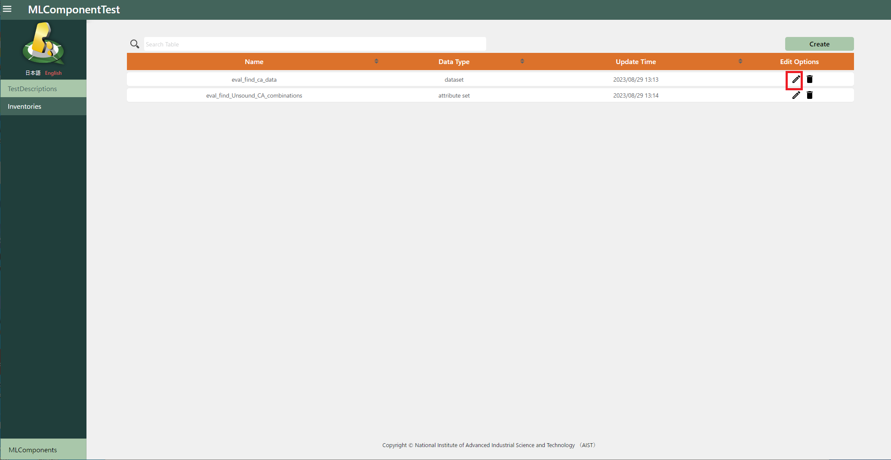
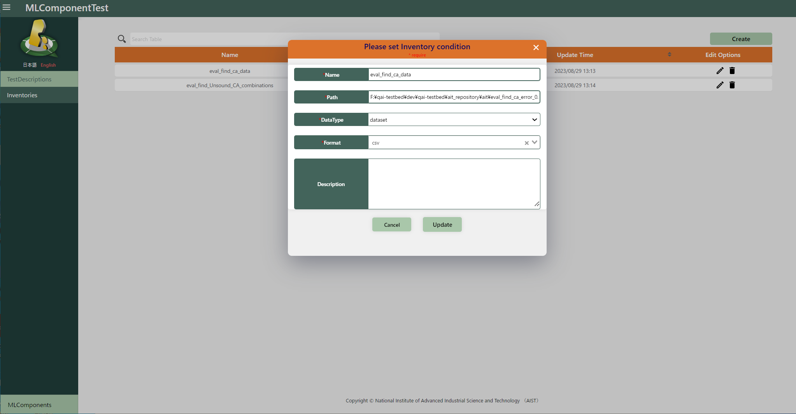
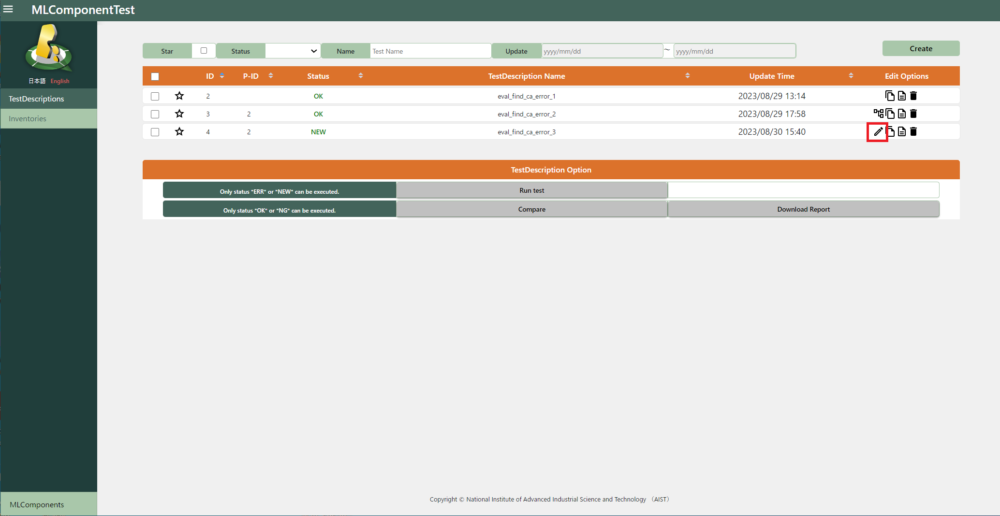
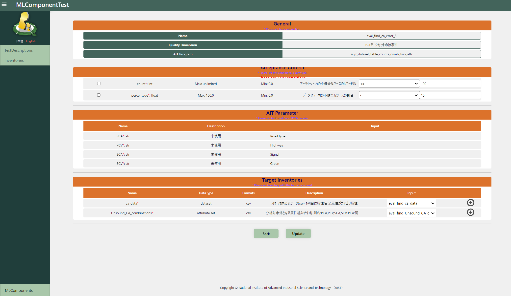

# 編集

## MLComponents修正

MLComponents一覧画面から修正対象の「edit」アイコンを押下すると、編集画面に遷移します。

編集し「Update」ボタンを押下すると更新されます。

## Inventories修正

Inventories一覧画面から修正対象の「edit」アイコンを押下すると、編集画面に遷移します。

編集し「Update」ボタンを押下すると更新されます。

## TestDescriptions修正

TestDescriptions一覧画面から修正対象の「edit」アイコンを押下すると、編集画面に遷移します。

（実行前かERRになったTestDescriptionしか「edit」アイコンが表示されません。）

TestDescriptionの基本情報を編集して「Next」ボタンを押下します。

TestDescriptionの詳細情報を編集して「Update」ボタンを押下すると更新されます。

