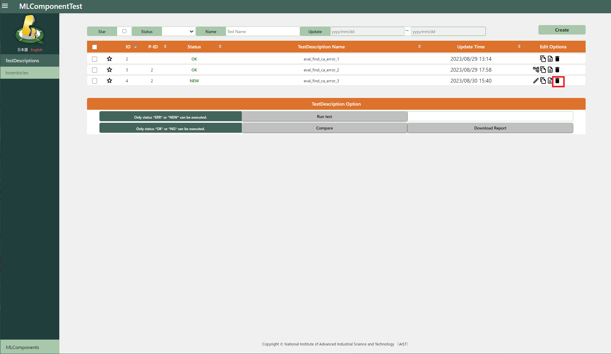
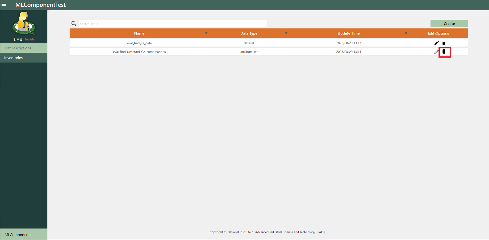
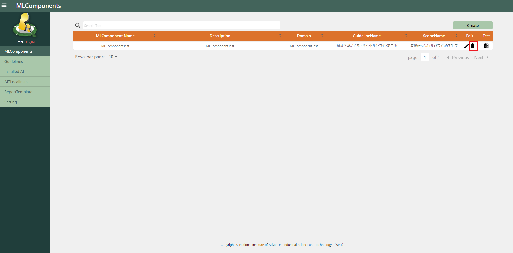
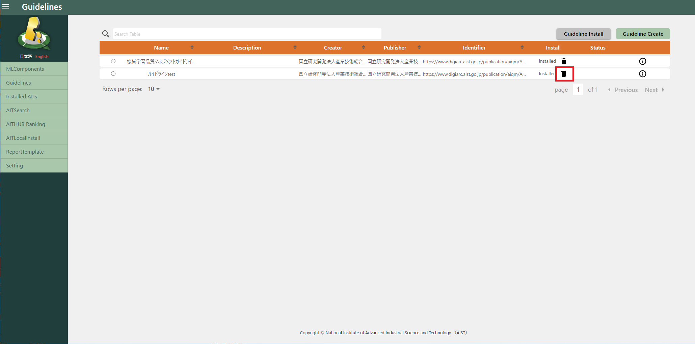
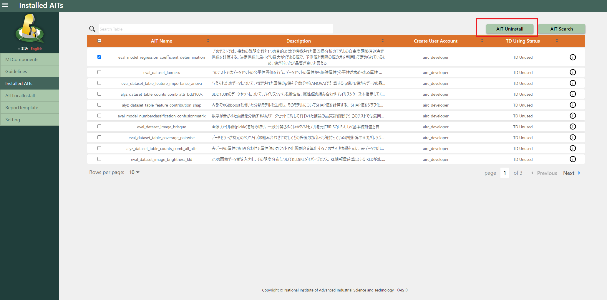

# 削除

## TestDescriptions削除

TestDescriptions一覧画面から削除対象の「delete」アイコンを押下すると削除できます。

## Inventories削除

Inventories一覧画面から削除対象の「delete」アイコンを押下すると削除できます。

## MLComponents削除

MLComponents一覧画面から削除対象の「delete」アイコンを押下すると削除できます。

（削除対象のMLComponent内にTestDescriptionやInventoryが存在すると削除できません。）

## ガイドラインを削除

Guidelines一覧画面から削除対象の「delete」アイコンを押下すると削除できます。

## AITをアンインストール

インストール済みAITリスト画面から「AIT Uninstall」ボタンを押下するとアンインストールできます。

（ターゲットとなるAITは全てのTestDescriptionの中で使用されていない状態にしてください。）

